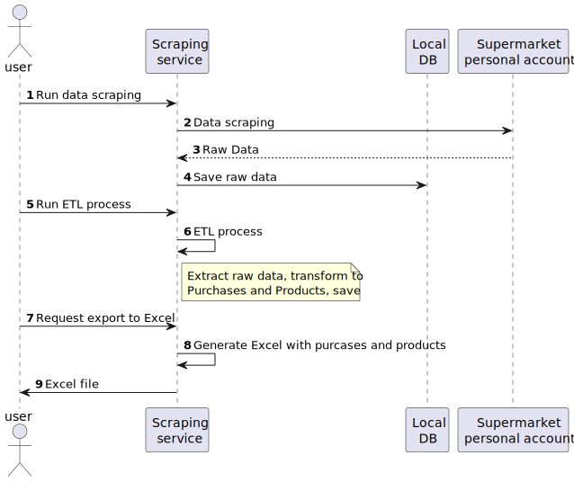

# Scraping data project

### Scraping process flow:

### Using technologies:
java 17, ide idea, git, xml, jackson json, maven, lombok, jpa (hibernate 6.3.1), 
spring framework 
spring boot 3.2.0, selenium 4.16.1, xPath, spring data jpa, apache commons, apache poi,
logback, 
springdoc open api, liquibase, postgres, rest, docker, docker-compose,
google dev tool, plant uml
